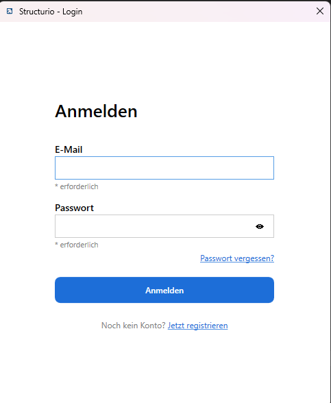
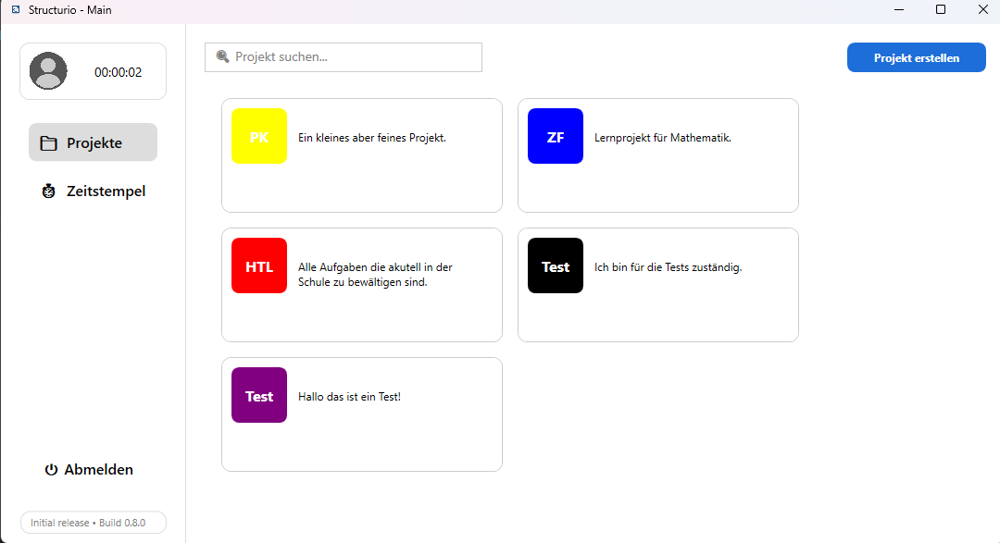
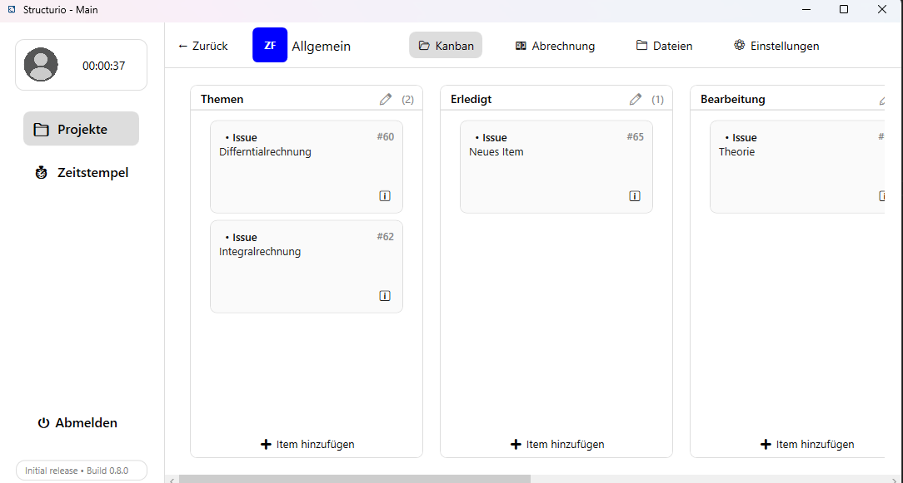
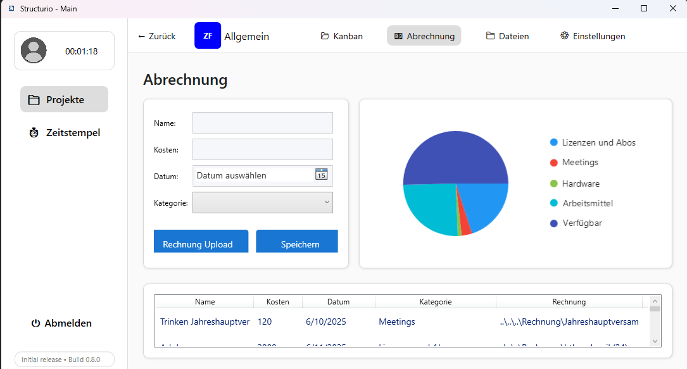
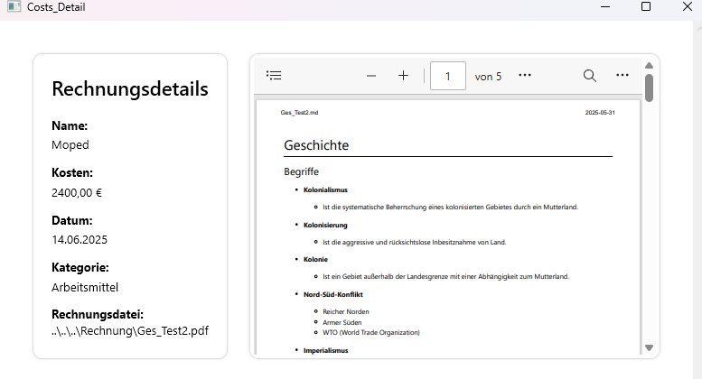
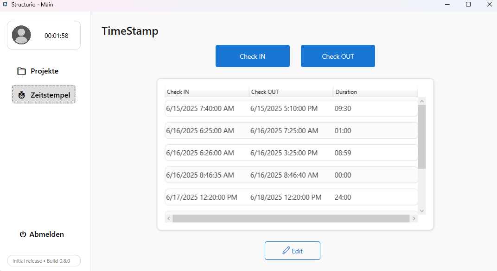
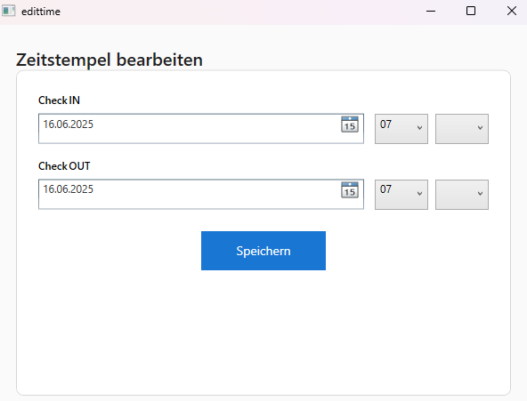

# Bedienungsanleitung – Structurio

## 1. Einleitung

**Structurio** ist eine Projektmanagement-Software mit Modulen zur Zeit- und Kostenverwaltung, Dateiorganisation, Aufgabenverwaltung (Kanban) sowie Projektkonfiguration. Diese Anleitung beschreibt die Bedienung für Benutzer und Projektmanager.

---

## 2. Erste Schritte

# Installiere noch folgendes Package für die Grafik:
    dotnet add package LiveChartsCore.SkiaSharpView.WPF --version 2.0.0-rc5.4

## Start Server
* Stelle sicher, dass der Server läuft. Öffne Visual Studio Code und starte im Backend die start_server.py Datei.
* Der Server sollte unter `http://localhost:8080` erreichbar sein.
* Aktivieren Sie mithilfe von "SELECT 1;" im Editor von unserem Datenbankserver Neon-Tech die Datenbank, auf die Sie aus authentifizierungsgründen leider keinen Zugriff haben. Jedoch können Sie, sollte die Datenbank nicht funktionieren, sich gerne an no-reply.  structurio@outlook.com wenden.
* Öffne die WPF-Anwendung Structurio in Visual Studio und starte sie.
* Die Anwendung öffnet sich und verbindet sich automatisch mit dem Backend.
* Sie sollten nun die Anmeldeseite sehen.

### 2.1 Anmeldung

* **Login:** Trage deine E-Mail und dein Passwort ein → Klicke auf „Anmelden“.
* **Passwort vergessen:** Klicke auf „Passwort vergessen?“ → Gib deine registrierte E-Mail ein.
* **Registrierung:** Klicke auf „Registrieren“ → Fülle alle Felder aus → „Registrieren“.

### 2.2 Nach dem Login

Nach erfolgreicher Anmeldung gelangst du zur **Projektübersicht** mit all deinen Projekten.

---

## 3. Projekte verwalten

### 3.1 Projekt erstellen

* Klicke auf **„+ Projekt“**.
* Gib einen Namen (max. 5 Zeichen), eine Beschreibung (max. 200 Zeichen) und eine Farbe ein.
* Klicke auf **„Erstellen“**.

### 3.2 Projekt öffnen

* Klicke auf eine Projektkarte, um zur Detailansicht zu gelangen.
* Du wirst standardmäßig zur **Kanban-Ansicht** weitergeleitet.

---

## 4. Modulübersicht (innerhalb eines Projekts)

### 4.1 Kanban-Board

* **Spalte hinzufügen:** „+ Spalte“.
* **Issue hinzufügen:** In Spalte → „+“ → Beschreibung eingeben → „Hinzufügen“.
* **Drag & Drop:** Aufgaben können per Maus in andere Spalten gezogen werden.
* **Bearbeiten/Löschen:** Doppelklick auf ein Issue → Änderungen speichern oder löschen.

### 4.2 Kostenverwaltung

* **Kosten eintragen:**

  * Gib Name, Betrag, Datum, Kategorie und eine PDF-Rechnung an.
  * Klicke auf „Speichern“.
* **Rechnungen hochladen:** Über „Datei auswählen“ im Uploadbereich.
* **Visualisierung:** Kreisdiagramm zeigt Budgetverteilung.
* **Details anzeigen:** Doppelklick auf einen Eintrag zeigt die PDF-Vorschau.

### 4.3 Zeiterfassung

* **Einchecken:** Klick auf „Check-In“ → aktueller Zeitstempel wird gesetzt.
* **Auschecken:** Klick auf „Check-Out“ → Dauer wird automatisch berechnet.
* **Bearbeiten:** Eintrag auswählen → „Ändern“ → Zeiten manuell einstellen.

### 4.4 Dateiverwaltung

* **PDFs hochladen:** „Upload“ klicken.
* **Dateityp:** Zwischen „Dateien“ und „Diagrammen“ wechseln.
* **Suche:** Textfeld nutzen, um PDFs zu filtern.
* **Vorschau:** Klicke auf eine Datei zur Ansicht im eigenen Fenster.

### 4.5 Projekteinstellungen

* **Name, Beschreibung und Farbe** ändern.
* **Projekt löschen:** „Löschen“ klicken → Bestätigen.

---

## 5. Tipps zur Nutzung

* **Farbkennzeichnung** für Projekte und Boards erhöht Übersicht.
* **Validierungen** verhindern fehlerhafte Eingaben und leere Felder.
* **E-Mail-Überprüfung** erkennt doppelte oder ungültige Registrierungen.
* **PDFs müssen gültig sein** (.pdf), sonst gibt es eine Fehlermeldung.
* **Alle Aktionen werden geloggt** – wichtig für Support und Fehleranalyse.

---

## 6. Fehlerbehandlung

* **Login schlägt fehl:** Zugangsdaten prüfen, Passwort sichtbar machen.
* **Keine Projekte sichtbar:** Neu laden oder Projekt erneut anlegen.
* **API/Netzwerkfehler:** Verbindung zur Backend-URL prüfen (`http://localhost:8080`).
* **Fehlende PDF:** Pfad und Dateiexistenz prüfen (z. B. „Rechnung“-Ordner).

