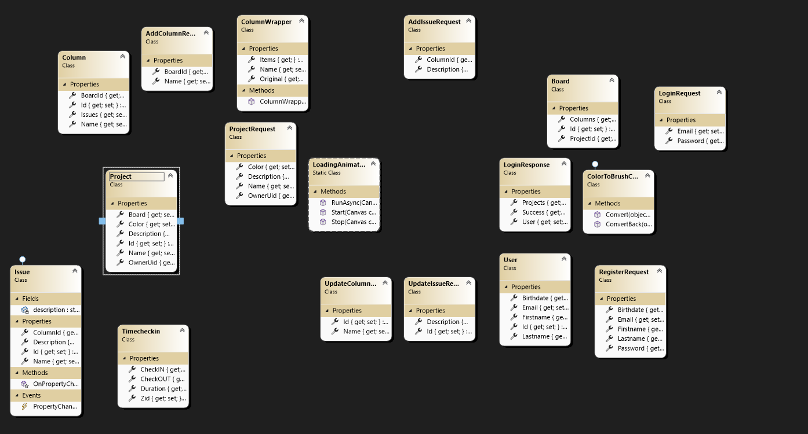

# Structurio Pflichtenheft

---

### Softwarevoraussetzungen

- .NET 8 (WPF)
- Microsoft.NETCore.App
- Microsoft.WindowsDesktop.App.WPF

#### Verwendete NuGet-Packages im Frontend:
- Extended.Wpf.Toolkit (4.7.25104.5739)
- LiveChartsCore.SkiaSharpView.WPF (2.0.0-rc5.4)
- MaterialDesignThemes (5.2.1)
- Microsoft.Web.WebView2 (1.0.3296.44)
- Moq (4.20.72)
- MSTest.TestAdapter (3.9.3)
- MSTest.TestFramework (3.9.3)
- Newtonsoft.Json (13.0.3)
- PdfiumViewer (2.13.0)
- PdfiumViewer.Native.x86.v8-xfa (2018.4.8.256)
- PdfiumViewer.Native.x86_64.v8-xfa (2018.4.8.256)
- Serilog (4.3.0)
- Serilog.Sinks.Console (6.0.0)
- Serilog.Sinks.File (7.0.0)
- SkiaSharp (3.119.0)
- System.Drawing.Common (9.0.6)

#### Python-Requirements im Backend:
- connexion[swagger-ui] >= 2.6.0; python_version>="3.6"
- connexion[swagger-ui] <= 2.3.0; python_version=="3.5" or python_version=="3.4"
- connexion[swagger-ui] <= 2.14.2; python_version>"3.4"
- werkzeug == 0.16.1; python_version=="3.5" or python_version=="3.4"
- swagger-ui-bundle >= 0.0.2
- python_dateutil >= 2.6.0
- setuptools >= 21.0.0
- Flask == 2.1.1
allgemein requirments.txt

### Funktionsblöcke / Architektur

Das Structurio-Projekt ist eine modulare WPF-Anwendung, die sich in mehrere funktionale Hauptbereiche gliedert:

* **Benutzerauthentifizierung:** Anmelde-, Registrierungs- und Passwort-Zurücksetzungsseiten, angebunden an eine REST-API mittels `HttpClient` und `IApiService` (SignInPage, SignUpPage, PasswordResetPage).
* **Projektverwaltung:** Übersicht, Erstellung, Bearbeitung und Löschung von Projekten, inklusive farblicher Markierung und Beschreibung (ProjectsPage, ProjectDetailPage, ProjectSettingsPage, CreateProjectWindow).
* **Kanban-System:** Dynamische Verwaltung von Spalten und Issues mit Drag-and-Drop, Inline-Bearbeitung und API-Synchronisation (KanbanPage, AddIssueWindow, UpdateIssueWindow, GhostWindow).
* **Zeitmanagement:** Ein- und Ausstempeln von Arbeitszeiten mit Bearbeitungsfunktionen und Dauerberechnung (TimeStamp, edittime).
* **Kostenverwaltung:** Erfassung, Visualisierung (Kreisdiagramm), Upload und Vorschau von Rechnungen im PDF-Format (Costs, costs\_Detail).
* **Dateiverwaltung:** Upload, Drag & Drop, Vorschau und Suche für PDF-Dateien in strukturierten Projektordnern (FilesPage, ProjectFoldersPage, FilePreviewWindow).
* **Logging:** Umfassendes Logging aller Benutzeraktionen mit Serilog zur Fehlerverfolgung und Analyse.

---

### Detaillierte Beschreibung der Umsetzung

* **Frontend:** Die Oberfläche basiert auf WPF mit MVVM-ähnlicher Struktur, jedoch ohne striktes MVVM-Pattern. Die UI ist responsiv und modular aufgebaut, z. B. durch UserControls wie `ProjectCard`, `FileBoxControl`, `FolderBoxControl`.
* **API-Integration:** Die Anwendung kommuniziert über `HttpClient` mit einem Backend (Swagger/OpenAPI basiert). Asynchrone Methoden stellen sicher, dass die UI nicht blockiert wird.
* **Validierung:** Umfangreiche Validierung erfolgt clientseitig (E-Mail-Formate, Passwortstärke, Eingabelängen, Pflichtfelder). Fehler werden visuell hervorgehoben.
* **Animations- und Ladezustände:** Ein `LoadingAnimation.RunAsync(...)` Wrapper stellt Ladeanimationen sicher, während API-Requests durchgeführt werden.
* **PDF-Handling:** PDF-Dateien werden entweder direkt gerendert (via `PdfiumViewer`) oder per WebView2 im Detail-Fenster angezeigt.
* **Diagramme:** In der Kostenansicht wird `LiveChartsCore` genutzt, um Budgetausgaben in einem Kreisdiagramm visuell darzustellen.
* **Projektnavigation:** Die `ProjectDetailPage` agiert als zentraler Knotenpunkt für untergeordnete Seiten (Kanban, Kosten, Dateien, Einstellungen).

---

### Mögliche Probleme und ihre Lösung

* **Netzwerkfehler bei API-Zugriffen:** Alle API-Aufrufe sind in Try-Catch-Blöcke gekapselt. Bei Ausfällen wird eine Fehlermeldung angezeigt und die Logs enthalten detaillierte Fehlerhinweise.
* **Ungültige Benutzereingaben:** Durch reguläre Ausdrücke, Maximalwerte und UI-Feedback wird sichergestellt, dass keine ungültigen Daten an die API gesendet werden.
* **Fehlende PDF-Dateien bei Vorschau:** Der PDF-Viewer prüft auf Dateiexistenz, bevor die Vorschau geladen wird, und meldet den Fehler mit Log-Eintrag und Usermeldung.
* **Ungültige Zeitbereiche bei Zeiterfassung:** Vor dem Speichern wird geprüft, dass Check-Out nicht vor Check-In liegt.
* **Race Conditions beim Drag-and-Drop:** Die Kanban-Logik enthält Kontrollmechanismen, um korrekte Spaltenzuordnung bei der Aktualisierung sicherzustellen.

---

### Wie wurde die Software getestet?

* **Manuelles UI-Testing:** Jede Seite wurde interaktiv getestet auf korrekte Darstellung, Validierung und Navigationslogik.
* **API-Mock-Tests:** Registrierungs-, Login- und Projekt-APIs wurden mit simulierten Eingaben getestet.
* **Fehlerfälle:** Netzwerkunterbrechungen, ungültige Eingaben, fehlende Dateien und leere Felder wurden gezielt simuliert.
* **Logging-Auswertung:** Serilog-Dateien wurden genutzt, um Logikpfade und mögliche Fehlerstellen zu analysieren.
* **Unit-Tests:** Einige Backend-Services (nicht in den hochgeladenen Dateien enthalten) basieren vermutlich auf Swagger-generierten Endpunkten und wurden extern validiert.

---

